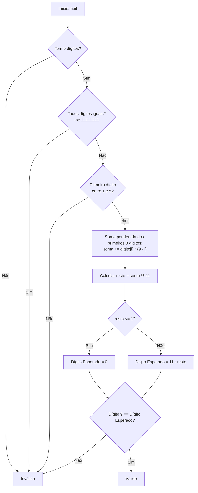
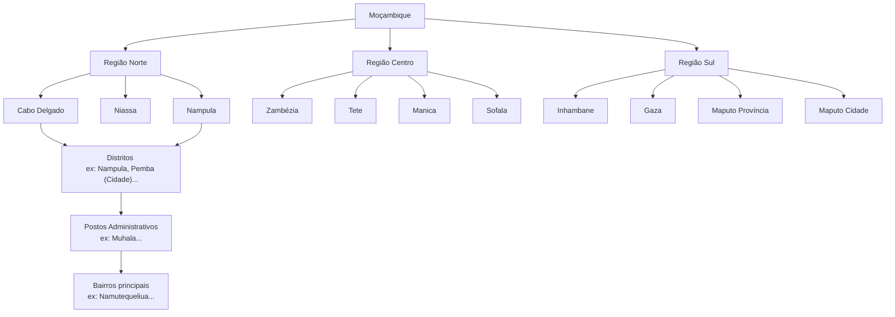

<h1 align="center">Moz-Utils</h1>

<p align="center">
  <b>Moz Utils Patch Dev</b> 🇲🇿
</p>

<p align="center">
  <a href="https://www.gnu.org/licenses/agpl-3.0">
    
  </a>
  <a href="http://makeapullrequest.com">
    
  </a>
  <a href="#">
    
  </a>
</p>

<p align="center">
  <i>O Canivete Suíço Definitivo para Programadores em Moçambique.</i>
</p>

<p align="justify">
  O <code>moz-utils</code> é uma coleção de funções essenciais de utilidade para o ecossistema moçambicano de desenvolvimento de software. Ele padroniza validações críticas como o <b>NUIT</b> (Número Único de Identificação Tributária), <b>BI</b> (Bilhete de Identidade), <b>números de telemóvel</b> (Vodacom, Tmcel, Movitel), <b>formatação de Meticais</b> (MZN) e <b>dados geográficos nacionais</b> (Províncias, Distritos, Postos Administrativos e Bairros).
</p>

<p align="justify">
  O projeto é mantido ativamente e portado para as linguagens mais populares usadas em África.
</p>

### ℹ️ Especificações de Moçambique

| Parâmetro | Detalhes |
| :--- | :--- |
| **País** | Moçambique |
| **Código de Chamada (DDI)** | `+258` |
| **Idioma Oficial** | Português (pt-MZ) |
| **Moeda Oficial** | Metical (`MZN` / `MT`) |

---

## 🗺️ Fluxos e Arquitetura

### 1. Validação de NUIT (Módulo 11)

<p align="justify">
  A validação segue estritamente as regras da Autoridade Tributária de Moçambique:
</p>



### 2. Hierarquia de Dados Geográficos

<p align="justify">
  Uma base estática robusta estruturada com dados oficiais do país:
</p>



---

## 🌍 Ecossistemas e Exemplos de Uso

| Ecossistema | Pasta | Gestor de Pacotes | Caso de Uso Principal |
| :--- | :--- | :--- | :--- |
| **[TypeScript / JS](./ts)** | `/ts` | NPM / PNPM / Yarn | Web React, Next.js, Node.js, Express |
| **[Python](./python)** | `/python` | Pip / Poetry | Django, FastAPI, Data Science |
| **[PHP](./php)** | `/php` | Composer | Laravel, Symfony, WordPress |
| **[Dart](./dart)** | `/dart` | Pub | Flutter (Aplicações Mobile) |
| **[Kotlin / Java](./kotlin)**| `/kotlin` | Gradle / Maven | Android Nativo, Spring Boot |

---

## 💻 Comparativo de Sintaxe

<p align="justify">
  Abaixo está um exemplo de como a API foi desenhada de forma homogénea em todas as linguagens:
</p>

=== "TypeScript"
    ```typescript
    import { isValidNUIT, formatMZN, buildWhatsAppUrl } from '@iradoweck/moz-utils';
    
    console.log(isValidNUIT('123456789')); // true
    console.log(formatMZN(1500));          // "1 500,00 MT"
    console.log(buildWhatsAppUrl('841234567', 'Olá Formiga Antonio, bem-vindo a Nampula!'));
    ```

=== "Python"
    ```python
    from moz_utils import is_valid_nuit, format_mzn, build_whatsapp_url

    print(is_valid_nuit('123456789')) # True
    print(format_mzn(1500))            # "1 500,00 MT"
    print(build_whatsapp_url('841234567', 'Olá Formiga Antonio, bem-vindo a Nampula!'))
    ```

=== "PHP"
    ```php
    use Iradoweck\MozUtils\MozUtils;

    echo MozUtils::isValidNUIT('123456789'); // true
    echo MozUtils::formatMZN(1500);          // "1 500,00 MT"
    echo MozUtils::buildWhatsAppUrl('841234567', 'Olá Formiga Antonio, bem-vindo a Nampula!');
    ```

=== "Dart"
    ```dart
    import 'package:moz_utils/moz_utils.dart';

    print(MozUtils.isValidNUIT('123456789')); // true
    print(MozUtils.formatMZN(1500));          // "1 500,00 MT"
    print(MozUtils.buildWhatsAppUrl('841234567', 'Olá Formiga Antonio, bem-vindo a Nampula!'));
    ```

=== "Kotlin"
    ```kotlin
    import com.edmilsonmuacigarro.mozutils.MozUtils

    println(MozUtils.isValidNUIT("123456789")) // true
    println(MozUtils.formatMZN(1500.0))         // "1 500,00 MT"
    println(MozUtils.buildWhatsAppUrl("841234567", "Olá Formiga Antonio, bem-vindo a Nampula!"))
    ```

---

## 🤝 Contribuição e Portabilidade

<p align="justify">
  O <code>moz-utils</code> é um projeto de código aberto e adoraríamos ter o seu apoio para adicionar mais linguagens (como <b>Go</b>, <b>Rust</b>, <b>Ruby</b> ou <b>C#</b>) ou para otimizar os padrões regex e bases de dados geográficas!
</p>

<p align="justify">
  Consulte o nosso <a href="./CONTRIBUTING.md">Guia de Contribuição</a> para saber mais sobre:
</p>
* A implementação algorítmica matemática do NUIT.
* Padronização de nomes de variáveis e funções.
* Criação de testes unitários para manter a integridade entre ecossistemas.

## 👥 Autores e Contribuidores

<p align="justify">
  Este projeto foi idealizado e é mantido por:
</p>

<p align="center">
  <a href="https://github.com/iradoweck" title="Edmilson Muacigarro (@iradoweck)">
    
  </a>
  &nbsp;&nbsp;
  <a href="https://github.com/zedecks" title="Zedecks IT (@zedecks)">
    
  </a>
</p>

---

## 📄 Licença

Este projeto é licenciado sob a licença **AGPL-3.0-or-later**.

---

<p align="center">
  Desenvolvido por <b>Edmilson Muacigarro</b> e contribuidores.
</p>
