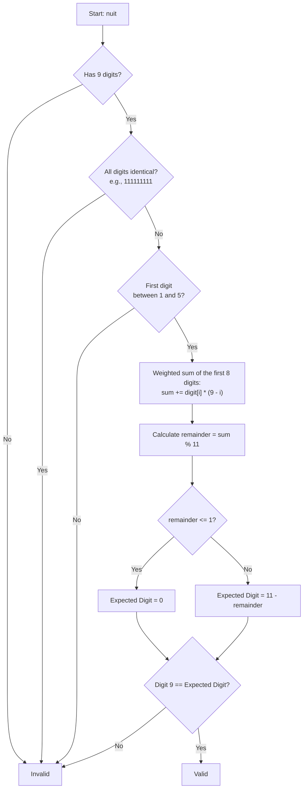
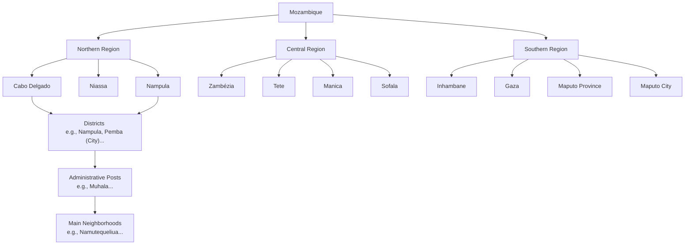

<h1 align="center">Moz-Utils</h1>

<p align="center">
  <b>Moz Utils Patch Dev</b> 🇲🇿
</p>

<p align="center">
  <a href="https://www.gnu.org/licenses/agpl-3.0">
    
  </a>
  <a href="http://makeapullrequest.com">
    
  </a>
  <a href="#">
    
  </a>
</p>

<p align="center">
  <i>The Definitive Swiss Army Knife for Software Developers in Mozambique.</i>
</p>

<p align="justify">
  <code>moz-utils</code> is a collection of essential utility functions tailored for the Mozambican software development ecosystem. It standardizes critical validations such as <b>NUIT</b> (Unique Tax Identification Number), <b>BI</b> (National Identity Card), <b>mobile phone numbers</b> (Vodacom, Tmcel, Movitel), <b>Metical currency formatting</b> (MZN), and <b>national geographical data</b> (Provinces, Districts, Administrative Posts, and Neighborhoods).
</p>

<p align="justify">
  The project is actively maintained and ported to the most popular programming languages used across Africa.
</p>

### ℹ️ Mozambique Specifications

| Parameter | Details |
| :--- | :--- |
| **Country** | Mozambique |
| **Calling Code (DDI)** | `+258` |
| **Official Language** | Portuguese (pt-MZ) |
| **Official Currency** | Metical (`MZN` / `MT`) |

---

## 🗺️ Workflows and Architecture

### 1. NUIT Validation (Modulo 11)

<p align="justify">
  The validation strictly follows the rules defined by the Tax Authority of Mozambique:
</p>



### 2. Geographical Data Hierarchy

<p align="justify">
  A robust offline static database structured with official administrative divisions of the country:
</p>



---

## 🌍 Ecosystems and Usage Examples

| Ecosystem | Folder | Package Manager | Primary Use Case |
| :--- | :--- | :--- | :--- |
| **[TypeScript / JS](./ts)** | `/ts` | NPM / PNPM / Yarn | React Web, Next.js, Node.js, Express |
| **[Python](./python)** | `/python` | Pip / Poetry | Django, FastAPI, Data Science |
| **[PHP](./php)** | `/php` | Composer | Laravel, Symfony, WordPress |
| **[Dart](./dart)** | `/dart` | Pub | Flutter (Mobile Applications) |
| **[Kotlin / Java](./kotlin)**| `/kotlin` | Gradle / Maven | Native Android, Spring Boot |

---

## 💻 Syntax Comparison

<p align="justify">
  Below is an example showing how homogeneous the API design is across all supported languages:
</p>

=== "TypeScript"
    ```typescript
    import { isValidNUIT, formatMZN, buildWhatsAppUrl } from 'moz-utils';
    
    console.log(isValidNUIT('123456789')); // true
    console.log(formatMZN(1500));          // "1 500,00 MT"
    console.log(buildWhatsAppUrl('841234567', 'Olá Formiga Antonio, bem-vindo a Nampula!'));
    ```

=== "Python"
    ```python
    from moz_utils import is_valid_nuit, format_mzn, build_whatsapp_url

    print(is_valid_nuit('123456789')) # True
    print(format_mzn(1500))            # "1 500,00 MT"
    print(build_whatsapp_url('841234567', 'Olá Formiga Antonio, bem-vindo a Nampula!'))
    ```

=== "PHP"
    ```php
    use Iradoweck\MozUtils\MozUtils;

    echo MozUtils::isValidNUIT('123456789'); // true
    echo MozUtils::formatMZN(1500);          // "1 500,00 MT"
    echo MozUtils::buildWhatsAppUrl('841234567', 'Olá Formiga Antonio, bem-vindo a Nampula!');
    ```

=== "Dart"
    ```dart
    import 'package:moz_utils/moz_utils.dart';

    print(MozUtils.isValidNUIT('123456789')); // true
    print(MozUtils.formatMZN(1500));          // "1 500,00 MT"
    print(MozUtils.buildWhatsAppUrl('841234567', 'Olá Formiga Antonio, bem-vindo a Nampula!'));
    ```

=== "Kotlin"
    ```kotlin
    import com.edmilsonmuacigarro.mozutils.MozUtils

    println(MozUtils.isValidNUIT("123456789")) // true
    println(MozUtils.formatMZN(1500.0))         // "1 500,00 MT"
    println(MozUtils.buildWhatsAppUrl("841234567", "Olá Formiga Antonio, bem-vindo a Nampula!"))
    ```

---

## 🤝 Contribution and Portability

<p align="justify">
  <code>moz-utils</code> is an open-source project, and we would love to have your support to port it to more languages (such as <b>Go</b>, <b>Rust</b>, <b>Ruby</b>, or <b>C#</b>) or to optimize regex patterns and geographic databases!
</p>

<p align="justify">
  Please refer to our <a href="./CONTRIBUTING.md">Contribution Guide</a> to learn more about:
</p>
* The mathematical implementation of NUIT validation.
* Code style and naming conventions.
* Writing unit tests to maintain parity across ecosystems.

## 👥 Authors and Contributors

<p align="justify">
  This project was conceptualized and is maintained by:
</p>

<p align="center">
  <a href="https://github.com/iradoweck" title="Edmilson Muacigarro (@iradoweck)">
    
  </a>
  &nbsp;&nbsp;
  <a href="https://github.com/zedecks" title="Zedecks IT (@zedecks)">
    
  </a>
</p>

---

## 📄 License

This project is licensed under the **AGPL-3.0-or-later** license.

---

<p align="center">
  Developed by <b>Edmilson Muacigarro</b> and contributors.
</p>
