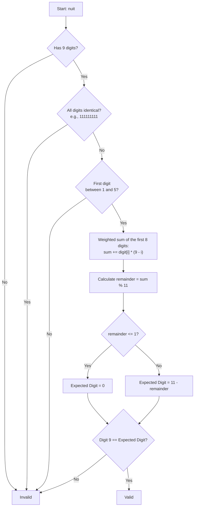
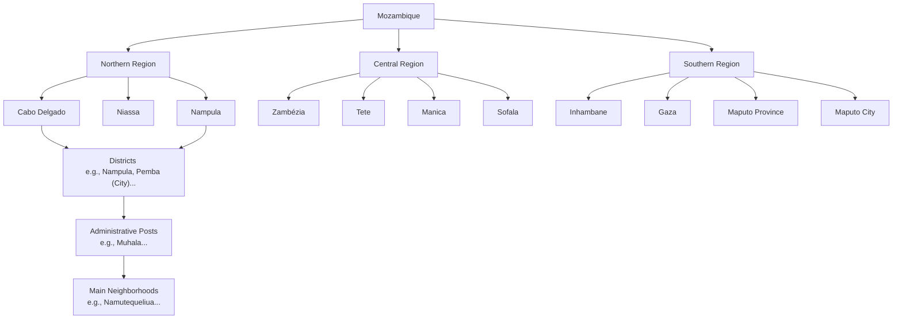

# Mozambique Kiwi Documentation

This document contains deep-dive architectural references, validation flowcharts, and administrative structure tables used by `moz-utils` validations.

## 1. Official Documents Validation

### BI (National Identity Card) Number Validation
- **Structure**: Exactly 12 numeric digits followed by 1 uppercase letter.
- **Example**: `110101234567A`.
- **Validation**:
  - Automatically cleans white spaces and hyphens.
  - Automatically converts letters to uppercase.
  - Returns `true` if the pattern matches `/^\d{12}[A-Z]$/`.

### NUIT (Unique Tax Identification Number) Modulo 11 Flow

The validation strictly follows the rules defined by the Tax Authority of Mozambique:

## 2. Geographical Data Hierarchy

A robust offline static database structured with official administrative divisions of the country:

### Table of Provinces & Districts

| Region | Province | Capital | Key Districts |
| :--- | :--- | :--- | :--- |
| **South** | Maputo City | Maputo | KaMpfumo, KaMaxaquene, KaMubukwana... |
| **South** | Maputo Province | Matola | Matola, Boane, Marracuene, Manhiça... |
| **South** | Gaza | Xai-Xai | Xai-Xai, Chókwè, Macia, Bilene... |
| **South** | Inhambane | Inhambane | Inhambane, Maxixe, Vilankulo... |
| **Central** | Sofala | Beira | Beira, Dondo, Búzi, Gorongosa... |
| **Central** | Manica | Chimoio | Chimoio, Manica, Gondola... |
| **Central** | Tete | Tete | Tete, Moatize, Angónia, Cahora Bassa... |
| **Central** | Zambézia | Quelimane | Quelimane, Mocuba, Gurúè... |
| **North** | Nampula | Nampula | Nampula, Nacala, Angoche, Ilha de Moçambique... |
| **North** | Cabo Delgado | Pemba | Pemba, Montepuez, Mocímboa da Praia... |
| **North** | Niassa | Lichinga | Lichinga, Cuamba, Lago... |

> **Note:** The `moz-utils` package uses these administrative divisions to resolve legacy Postal Codes into the new 6-digit CEP system.
