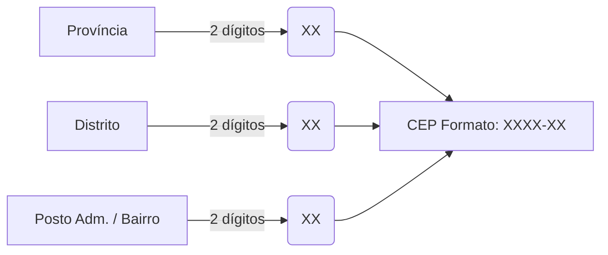

# Códigos Postais de Moçambique

Esta tabela contém a lista de códigos postais legados de Moçambique, organizados por região, província e localidade, historicamente geridos e validados pelos **Correios de Moçambique**.

> [!NOTE]
> Estes códigos postais são compostos por **4 dígitos**, onde os dois primeiros dígitos (prefixo) identificam a província/região postal.

---

## 📍 Região Sul

### Maputo (Província e Cidade) — Prefixo 11

| Código | Localidade / Estação | Código | Localidade / Estação |
| :--- | :--- | :--- | :--- |
| **1100** | Maputo ECP (Sede) | **1113** | Fomento |
| **1101** | Polana | **1114** | Matola |
| **1102** | Sommerchild | **1115** | Boane |
| **1103** | Malhangalene | **1116** | Namaacha |
| **1104** | Alto-Maé | **1117** | Katembe |
| **1106** | Bairro Central | **1118** | Bela-Vista |
| **1107** | Bairro do Aeroporto | **1119** | Inhaca |
| **1108** | Bairro do Mavalane | **1120** | Marracuene |
| **1109** | Bairro do Jardim | **1121** | Manhiça |
| **1110** | Bairro do Xipamanine | **1122** | Xinavane |
| **1111** | Bairro George Dimitrov | **1123** | Magude |
| **1112** | Machava | **1124** / **1125** | Moamba / Ressano Garcia |

### Gaza — Prefixo 12

| Código | Localidade / Estação | Código | Localidade / Estação |
| :--- | :--- | :--- | :--- |
| **1200** | Xai-Xai ECP | **1206** | Mabalane |
| **1201** | Praia de Xai-Xai | **1207** | Massingir |
| **1202** | Macia | **1208** | Chibuto |
| **1203** | Praia de Bilene | **1209** | Manjacaze |
| **1204** | Chokwé | **1210** | Chidenguele |
| **1205** | Chilembene / Magoanine | **1211** | Chicualacuala |

### Inhambane — Prefixo 13

| Código | Localidade / Estação | Código | Localidade / Estação |
| :--- | :--- | :--- | :--- |
| **1300** | Inhambane ECP | **1308** | Cumbane |
| **1301** | Maxixe | **1309** | Homoine |
| **1302** | Morrumbene | **1310** | Panda |
| **1303** | Massinga | **1311** | Inharrime |
| **1304** | Vilanculos | **1312** | Quissico |
| **1305** | Inhassoro | **1313** | Funhalouro |
| **1306** | Nova-Mambone | **1314** | Mabote |
| **1307** | Jangamo | | |

---

## 📍 Região Centro

### Sofala (Prefixo 21) e Manica (Prefixo 22)

| Província | Código | Localidade | Província | Código | Localidade |
| :--- | :--- | :--- | :--- | :--- | :--- |
| **Sofala** | **2100** | Beira ECP | **Manica** | **2200** | Chimoio ECP |
| **Sofala** | **2101** | Macúti | **Manica** | **2201** | Catandica |
| **Sofala** | **2102** | Beira Aeroporto | **Manica** | **2202** | Vila de Manica |
| **Sofala** | **2103** | Manga | **Manica** | **2203** | Gondola |
| **Sofala** | **2104** | Dondo | **Manica** | **2204** | Guro |
| **Sofala** | **2105** | Mafambisse | **Manica** | **2205** | Machaze |
| **Sofala** | **2106** | Nhamatanda | **Manica** | **2206** | Macossa |
| **Sofala** | **2107** | Buzi | **Manica** | **2207** | Sussundenga |
| **Sofala** | **2110** | Gorongoza | **Manica** | **2208** | Tambara |

### Tete (Prefixo 23) e Zambézia (Prefixo 24)

| Província | Código | Localidade | Província | Código | Localidade |
| :--- | :--- | :--- | :--- | :--- | :--- |
| **Tete** | **2300** | Tete ECP | **Zambézia** | **2400** | Quelimane ECP |
| **Tete** | **2301** | Tete Aeroporto | **Zambézia** | **2401** | Nicoadala |
| **Tete** | **2302** | Moatize | **Zambézia** | **2403** | Mocuba |
| **Tete** | **2304** | Songo | **Zambézia** | **2405** | Pebane |
| **Tete** | **2307** | Mutarara | **Zambézia** | **2407** | Gurué |
| **Tete** | **2312** | Zumbo | **Zambézia** | **2412** | Chinde |

---

## 📍 Região Norte

### Nampula — Prefixo 31

| Código | Localidade / Estação | Código | Localidade / Estação |
| :--- | :--- | :--- | :--- |
| **3100** | Nampula ECP | **3108** | Moma |
| **3101** | Angoche | **3112** | Nacala |
| **3102** | Monapo | **3115** | Namapa |
| **3105** | Ilha de Moçambique | **3119** | Ribaue |

### Cabo Delgado (Prefixo 32) e Niassa (Prefixo 33)

| Província | Código | Localidade | Província | Código | Localidade |
| :--- | :--- | :--- | :--- | :--- | :--- |
| **C. Delgado** | **3200** | Pemba ECP | **Niassa** | **3300** | Lichinga ECP |
| **C. Delgado** | **3201** | Pemba-2 | **Niassa** | **3301** | Macanhelas |
| **C. Delgado** | **3208** | Montepuez | **Niassa** | **3305** | Cuamba |
| **C. Delgado** | **3216** | Mueda | **Niassa** | **3304** | Mandimba |
| **C. Delgado** | **3219** | Palma | **Niassa** | **3311** | Muembe |


# 🇲🇿 Sistema de Código de Endereçamento Postal (CEP) - Moçambique

Este documento detalha o funcionamento, a estrutura numérica e a tabela de indexação do **Código de Endereçamento Postal (CEP)** de Moçambique, baseado nas diretrizes oficiais estabelecidas pelo **INCM (Instituto Nacional das Comunicações de Moçambique)**.

---

## 📌 O que é o CEP?

O Código de Endereçamento Postal (ou CEP) é um sistema de codificação numérica estabelecido para as unidades territoriais Moçambicanas. 

Este CEP é composto por **seis algarismos**, que correspondem à justaposição sequencial de três níveis de organização territorial:
1. **Código da Província** (2 dígitos)
2. **Código do Distrito** (2 dígitos)
3. **Código do Posto Administrativo** (ou Bairro) (2 dígitos)

O código da Província e do Distrito são separados do código do Posto Administrativo por um hífen (`-`).

---

## ⚙️ Estrutura Numérica

A composição do CEP baseia-se na seguinte estrutura visual:



**Esquema de Formatação:**
```text
 [X][X]        [X][X]     -     [X][X]
Código da    Código do     Código do Posto
Província    Distrito      Administrativo
```

> [!NOTE]
> O formato padrão obriga a separação por um hífen (`-`) posicionado exatamente antes dos dois últimos algarismos.

### 🗺️ Regras de Validação (Regex)
* **Máscara de Input:** `9999-99`
* **Expressão Regular (Regex) para Validação:** `/^\d{4}-\d{2}$/`

---

## 📊 Tabela de Prefixos por Província

Os quatro primeiros dígitos (Província + Distrito) servem como a base de geolocalização do país. Abaixo encontram-se os blocos de prefixos iniciais atribuídos a cada província:

| Código da Província | Província | Intervalo de Blocos (Distritos) | Exemplo de Sede |
| :---: | :--- | :---: | :--- |
| **01** | Cidade de Maputo | `0101` a `0107` | KaMpfumo (`0101`) |
| **02** | Província de Maputo | `0201` a `0208` | Matola (`0204`) |
| **03** | Província de Gaza | `0301` a `0314` | Xai-Xai (`0302`) |
| **04** | Província de Inhambane | `0401` a `0414` | Cidade de Inhambane (`0404`) |
| **05** | Província de Sofala | `0501` a `0513` | Beira (`0504`) |
| **06** | Província de Manica | `0601` a `0612` | Chimoio (`0606`) |
| **07** | Província de Tete | `0701` a `0715` | Cidade de Tete (`0705`) |
| **08** | Província da Zambézia | `0801` a `0822` | Quelimane (`0804`) |
| **09** | Província de Nampula | `0901` a `0922` | Cidade de Nampula (`0909`) |
| **10** | Província de Cabo Delgado | `1001` a `1017` | Pemba (`1005`) |
| **11** | Província de Niassa | `1101` a `1116` | Lichinga (`1111`) |

---

## 🛠️ Exemplos Práticos de Endereçamento

Para compreender como a justaposição funciona na prática, analise os três cenários distintos a seguir extraídos da base de dados do INCM:

### Cenário A: Zona Urbana (Divisão por Bairros)
* **Local:** Alto Maé "A", Distrito de KaMpfumo, Cidade de Maputo.
* **Construção do CEP:** 
  * Província (Cidade de Maputo) = `01`
  * Distrito (KaMpfumo) = `01`
  * Bairro (Alto Maé "A") = `01`
* **CEP Final:** `0101-01`

### Cenário B: Zona Provincial Sede (Divisão por Posto Administrativo)
* **Local:** Posto Administrativo de Ressano Garcia, Distrito da Moamba, Província de Maputo.
* **Construção do CEP:** 
  * Província (Maputo Província) = `02`
  * Distrito (Moamba) = `06`
  * Posto Administrativo (Ressano Garcia) = `03`
* **CEP Final:** `0206-03`

### Cenário C: Distrito Distante (Zonas Rurais/Sedes)
* **Local:** Posto Administrativo de Metangula (Sede), Distrito do Lago, Província de Niassa.
* **Construção do CEP:**
  * Província (Niassa) = `11`
  * Distrito (Lago) = `16`
  * Posto Administrativo (Metangula Sede) = `04`
* **CEP Final:** `1116-04`

---
> *Fonte das especificações: Instituto Nacional das Comunicações de Moçambique (INCM).*


---

## 📍 Tabela Completa de Códigos por Província e Distrito

### Província de Cabo Delgado (Prefixo 10)

| Distrito / Município | Posto Administrativo / Bairro | Código CEP |
| :--- | :--- | :---: |
| **Mecúfi** | Mecúfi (Sede) | `1001-01` |
| | Murrébué | `1001-02` |
| **Chiúre** | Chiúre (Sede) | `1002-01` |
| | Chiúre-Velho | `1002-02` |
| | Katapua | `1002-03` |
| | Mazeze | `1002-04` |
| | Namogelia | `1002-05` |
| | Ocua | `1002-06` |
| **Namuno** | Hucula | `1003-01` |
| | Machoca | `1003-02` |
| | Meloco | `1003-03` |
| | Namuno (Sede) | `1003-04` |
| | N'Cumpe | `1003-05` |
| | Papai | `1003-06` |
| **Balama** | Balama (Sede) | `1004-01` |
| | Impiri | `1004-02` |
| | Kuékué | `1004-03` |
| | Mavale | `1004-04` |
| | Pemba (Cidade | `Bairros)` |
| | Alto Gingone | `1005-01` |
| | Cariacó | `1005-02` |
| | Cimento (Sede) | `1005-03` |
| | Chuiba | `1005-04` |
| | Eduardo Mondlane | `1005-05` |
| | Ingonane | `1005-06` |
| | Marranganha | `1005-07` |
| | Muxara | `1005-08` |
| | Natite | `1005-09` |
| | Paquitequete | `1005-10` |
| **Metuge** | Metuge (Sede) | `1006-01` |
| | Mieze | `1006-02` |
| **Ancuabe** | Ancuabe (Sede) | `1007-01` |
| | Metoro | `1007-02` |
| | Mesa | `1007-03` |
| **Quissanga** | Bilibiza | `1008-01` |
| | Mahate | `1008-02` |
| | Quissanga (Sede) | `1008-03` |
| **Ibo** | Ibo (Sede) | `1009-01` |
| | Quirimba | `1009-02` |
| **Meluco** | Meluco (Sede) | `1010-01` |
| | Muaguide | `1010-02` |
| **Montepuez** | Mapupulo | `1011-01` |
| | Mirate | `1011-02` |
| | Montepuez (Sede) | `1011-03` |
| | Nairoto | `1011-04` |
| | Namanhumbir | `1011-05` |
| **Macomia** | Chai | `1012-01` |
| | Macomia (Sede) | `1012-02` |
| | Mucojo | `1012-03` |
| | Quiterajo | `1012-04` |
| **Muidumbe** | Chitunda | `1013-01` |
| | Miteda | `1013-02` |
| | Muidumbe (Sede) | `1013-03` |
| **Mocímboa da Praia** | Diaca | `1014-01` |
| | Mbau | `1014-02` |
| | Mocímboa da Praia (Sede) | `1014-03` |
| **Mueda** | Chapa | `1015-01` |
| | Imbuo | `1015-02` |
| | Mueda (Sede) | `1015-03` |
| | Negomano | `1015-04` |
| | N'gapa | `1015-05` |
| **Palma** | Olumbi | `1016-01` |
| | Palma (Sede) | `1016-02` |
| | Pundanhar | `1016-03` |
| | Quionga | `1016-04` |
| **Nangade** | Nangade (Sede) | `1017-01` |
| | N'tamba | `1017-02` |

### Província de Niassa (Prefixo 11)

| Distrito / Município | Posto Administrativo / Bairro | Código CEP |
| :--- | :--- | :---: |
| **Cuamba** | Cuamba (Sede) | `1101-01` |
| | Etatara | `1101-02` |
| | Lúrio | `1101-03` |
| **Mecanhelas** | Chiúta | `1102-01` |
| | Insaca (Sede) | `1102-02` |
| **Metarica** | Metarica (Sede) | `1103-01` |
| | Nacumua | `1103-02` |
| **Mandimba** | Mandimba (Sede) | `1104-01` |
| | Mitande | `1104-02` |
| **Nipepe** | Muipite | `1105-01` |
| | Nipepe (Sede) | `1105-02` |
| **Maúa** | Maiaca | `1106-01` |
| | Maúa (Sede) | `1106-02` |
| **Marrupa** | Marangira | `1107-01` |
| | Marrupa (Sede) | `1107-02` |
| | Nungo | `1107-03` |
| **Majune** | Malanga (Sede) | `1108-01` |
| | Muaquia | `1108-02` |
| | Nairubi | `1108-03` |
| **Ngaúma** | Itepela | `1109-01` |
| | Massangulo (Sede) | `1109-02` |
| **Chimbunila** | Chimbunila (Sede) | `1110-01` |
| | Lione | `1110-02` |
| **Lichinga (Cidade / Distrito)** | Lichinga (Sede) | `1111-01` |
| | Meponda | `1111-02` |
| **Mecula** | Matondovela | `1112-01` |
| | Mecula (Sede) | `1112-02` |
| **Mavago** | Mavago (Sede) | `1113-01` |
| | M'Sawise | `1113-02` |
| **Muembe** | Chiconono | `1114-01` |
| | Muembe (Sede) | `1114-02` |
| **Sanga** | Lussimbesse | `1115-01` |
| | Macaloge | `1115-02` |
| | Matchedje | `1115-03` |
| | Unango (Sede) | `1115-04` |
| **Lago** | Cóbuè | `1116-01` |
| | Lunho | `1116-02` |
| | Maniamba | `1116-03` |
| | Metangula (Sede) | `1116-04` |

### Província de Nampula (Prefixo 09)

| Distrito / Município | Posto Administrativo / Bairro | Código CEP |
| :--- | :--- | :---: |
| **Moma** | Chalaua | `0901-01` |
| | Moma (Sede) | `0901-02` |
| **Larde** | Larde (Sede) | `0902-01` |
| | Mucuali | `0902-02` |
| **Angoche** | Angoche (Sede) | `0903-01` |
| | Aúbe | `0903-02` |
| | Boila | `0903-03` |
| | Namaponda | `0903-04` |
| **Mogovolas** | Calipo | `0904-01` |
| | Iulúti | `0904-02` |
| | Muatua | `0904-03` |
| | Nametil (Sede) | `0904-04` |
| | Nanhupo-Rio | `0904-05` |
| **Murrupula** | Chinga | `0905-01` |
| | Murrupula (Sede) | `0905-02` |
| | Nihessiue | `0905-03` |
| **Liúpo** | Liúpo (Sede) | `0906-01` |
| | Quinga | `0906-02` |
| **Mongicual** | Namige (Sede) | `0907-01` |
| | Quixaxe | `0907-02` |
| **Meconta** | 7 de Abril | `0908-01` |
| | Corrane | `0908-02` |
| | Meconta (Sede) | `0908-03` |
| | Namialo | `0908-04` |
| **Nampula** | Anchilo | `0909-01` |
| | Central (Sede) | `0909-02` |
| | Muatala | `0909-03` |
| | Namicopo | `0909-04` |
| | Napipine | `0909-05` |
| | Natikire | `0909-06` |
| **Rapale** | Mutivasse | `0910-01` |
| | Namaita | `0910-02` |
| | Rapale (Sede) | `0910-03` |
| **Ribáuè** | Cunle | `0911-01` |
| | Iapala | `0911-02` |
| | Ribáuè (Sede) | `0911-03` |
| **Malema** | Canhunha | `0912-01` |
| | Chihulo | `0912-02` |
| | Malema (Sede) | `0912-03` |
| | Mutuáli | `0912-04` |
| **Ilha de Moçambique** | Ilha de Moçambique (Sede) | `0913-01` |
| | Lumbo | `0913-02` |
| **Mossuril** | Lunga | `0914-01` |
| | Matibane | `0914-02` |
| | Mossuril (Sede) | `0914-03` |
| **Monapo** | Itoculo | `0915-01` |
| | Monapo (Sede) | `0915-02` |
| | Netia | `0915-03` |
| **Muecate** | Imala | `0916-01` |
| | Muculuone | `0916-02` |
| | Muecate (Sede) | `0916-03` |
| **Mecubúri** | Mecubúri (Sede) | `0917-01` |
| | Milhana | `0917-02` |
| | Muíte | `0917-03` |
| | Namina | `0917-04` |
| **Lalaua** | Lalaua (Sede) | `0918-01` |
| | Méti | `0918-02` |
| **Nacala** | Muanona | `0919-01` |
| | Mutiva (Sede) | `0919-02` |
| **Nacala-a-Velha** | Covó | `0920-01` |
| | Nacala-a-Velha (Sede) | `0920-02` |
| **Nacarôa** | Inteta | `0921-01` |
| | Nacarôa (Sede) | `0921-02` |
| | Saua-Saua | `0921-03` |
| **Memba** | Chipene | `0922-01` |
| | Lúrio | `0922-02` |
| | Mazua | `0922-03` |
| | Memba (Sede) | `0922-04` |
| **Eráti** | Alaua | `0922-01` |
| | Namapa (Sede) | `0922-02` |
| | Namirôa | `0922-03` |

### Província de Manica (Prefixo 06)

| Distrito / Município | Posto Administrativo / Bairro | Código CEP |
| :--- | :--- | :---: |
| **Machaze** | Chitobe (Sede) | `0601-01` |
| | Save | `0601-02` |
| **Mossurize** | Chiurairue | `0602-01` |
| | Dacata | `0602-02` |
| | Espungabera (Sede) | `0602-03` |
| **Sussundenga** | Dombe | `0603-01` |
| | Muoha | `0603-02` |
| | Rotanda | `0603-03` |
| | Sussundenga (Sede) | `0603-04` |
| **Macate** | Macate (Sede) | `0604-01` |
| | Zembe | `0604-02` |
| **Gondola** | Amatongas | `0605-01` |
| | Cafumpe | `0605-02` |
| | Gondola (Sede) | `0605-03` |
| | Inchope | `0605-04` |
| | Chimoio (Cidade | `Postos Administrativos)` |
| | Posto Adm. Nº 1 (Sede) | `0606-01` |
| | Posto Adm. Nº 2 | `0606-02` |
| | Posto Adm. Nº 3 | `0606-03` |
| **Vanduzi** | Matsinho | `0607-01` |
| | Vanduzi (Sede) | `0607-02` |
| **Manica** | Manica (Sede) | `0608-01` |
| | Machipanda | `0608-02` |
| | Mavonde | `0608-03` |
| | Messica | `0608-04` |
| **Macossa** | Macossa (Sede) | `0609-01` |
| | Nguawala | `0609-02` |
| | Nhamagua | `0609-03` |
| **Bárue** | Catandica (Sede) | `0610-01` |
| | Choa | `0610-02` |
| | Nhampassa | `0610-03` |
| **Tambara** | Buzua | `0611-01` |
| | Nhacafula | `0611-02` |
| | Nhacolo (Sede) | `0611-03` |
| **Guro** | Guro (Sede) | `0612-01` |
| | Mandie | `0612-02` |
| | Mungari | `0612-03` |
| | Nhamassonge | `0612-04` |

### Província de Tete (Prefixo 07)

| Distrito / Município | Posto Administrativo / Bairro | Código CEP |
| :--- | :--- | :---: |
| **Mutarara** | Charre | `0701-01` |
| | Inhangoma | `0701-02` |
| | Nhamayabué (Sede) | `0701-03` |
| **Dôa** | Chueza | `0702-01` |
| | Dôa (Sede) | `0702-02` |
| **Changara** | Chiôco | `0703-01` |
| | Luenha (Sede) | `0703-02` |
| **Moatize** | Kambulatsitsi | `0704-01` |
| | Moatize (Sede) | `0704-02` |
| | Zóbuè | `0704-03` |
| | Tete (Cidade | `Bairros / Zonas urbanas)` |
| | Chingodzi | `0705-01` |
| | Dégue | `0705-02` |
| | Filipe Samuel Magaia | `0705-03` |
| | Franscisco Manyanga | `0705-04` |
| | Josina Machel | `0705-05` |
| | Mateus Sansão Muthemba | `0705-06` |
| | Matundo | `0705-07` |
| | Mpádué | `0705-08` |
| | Samora Machel | `0705-09` |
| **Marara** | Marara (Sede) | `0706-01` |
| | Mufa-Boroma | `0706-02` |
| **Cahora-Bassa** | Chintholo | `0707-01` |
| | Chitima (Sede) | `0707-02` |
| | Songo | `0707-03` |
| **Mágoè** | Chinthopo | `0708-01` |
| | Mphende (Sede) | `0708-02` |
| | Mukumbura | `0708-03` |
| **Tsangano** | Ntengo-Wa-Mbalame | `0709-01` |
| | Tsangano (Sede) | `0709-02` |
| **Chiúta** | Kazula | `0710-01` |
| | Manje (Sede) | `0710-02` |
| **Marávia** | Chipera | `0711-01` |
| | Chiputu | `0711-02` |
| | Fíngoè (Sede) | `0711-03` |
| | Malowera | `0711-04` |
| **Zumbo** | Muze | `0712-01` |
| | Zâmbuè | `0712-02` |
| | Zumbo (Sede) | `0712-03` |
| **Angónia** | Dómuè | `0713-01` |
| | Ulónguè (Sede) | `0713-02` |
| **Macanga** | Chidzolomondo | `0714-01` |
| | Furancungo (Sede) | `0714-02` |
| **Chifunde** | Chifunde (Sede) | `0715-01` |
| | Mualadzi | `0715-02` |
| | N'Sadzu | `0715-03` |

### Província da Zambézia (Prefixo 08)

| Distrito / Município | Posto Administrativo / Bairro | Código CEP |
| :--- | :--- | :---: |
| **Chinde** | Chinde (Sede) | `0801-01` |
| | Micaúne | `0801-02` |
| **Luabo** | Chimbazo | `0802-01` |
| | Luabo (Sede) | `0802-02` |
| **Inhassunge** | Gonhane | `0803-01` |
| | Inhassunge (Sede) | `0803-02` |
| | Quelimane (Cidade | `Postos Administrativos)` |
| | Posto Adm. Nº 1 (Sede) | `0804-01` |
| | Posto Adm. Nº 2 | `0804-02` |
| | Posto Adm. Nº 3 | `0804-03` |
| | Posto Adm. Nº 4 | `0804-04` |
| | Posto Adm. Nº 5 | `0804-05` |
| | Maquival | `0804-06` |
| **Mopeia** | Campo | `0805-01` |
| | Mopeia (Sede) | `0805-02` |
| **Namacurra** | Macuse | `0806-01` |
| | Namacurra (Sede) | `0806-02` |
| **Nicoadala** | Nicoadala (Sede) | `0807-01` |
| **Maganja da Costa** | Baixo Licungo | `0801-02` |
| | Maganja (Sede) | `0808-02` |
| **Mocubela** | Bajone | `0809-01` |
| | Mocubela (Sede) | `0809-02` |
| **Mocuba** | Mocuba (Sede) | `0810-01` |
| | Mugeba | `0810-02` |
| | Namanjavira | `0810-03` |
| **Derre** | Derre (Sede) | `0811-01` |
| | Guerissa | `0811-02` |
| **Morrumbala** | Chire | `0812-01` |
| | Megaza | `0812-02` |
| | Morrumbala (Sede) | `0812-03` |
| **Pebane** | Mulela | `0813-01` |
| | Nabúri | `0813-02` |
| | Pebane (Sede) | `0813-03` |
| **Mulevala** | Chiraco | `0814-01` |
| | Mulevala (Sede) | `0814-02` |
| **Lugela** | Lugela (Sede) | `0815-01` |
| | Muabanama | `0815-02` |
| | Munhamade | `0815-03` |
| | Tacuane | `0815-04` |
| **Milange** | Majaua | `0816-01` |
| | Milange (Sede) | `0816-02` |
| | Mongue | `0816-03` |
| **Gilé** | Alto Ligonha | `0817-01` |
| | Gilé (Sede) | `0817-02` |
| **Alto Molócuè** | Molócuè (Sede) | `0818-01` |
| | Nauela | `0818-02` |
| **Ile** | Ile (Sede) | `0819-01` |
| | Namigonha | `0819-02` |
| | Socone | `0819-03` |
| **Namarrói** | Namarroi (Sede) | `0820-01` |
| | Regone | `0820-02` |
| **Molumbo** | Corromana | `0821-01` |
| | Molumbo (Sede) | `0821-02` |
| **Guruè** | Guruè (Sede) | `0822-01` |
| | Lioma | `0822-02` |
| | Mepuagiua | `0822-03` |

### Província de Inhambane (Prefixo 04)

| Distrito / Município | Posto Administrativo / Bairro | Código CEP |
| :--- | :--- | :---: |
| **Zavala** | Quissico (Sede) | `0401-01` |
| | Zandamela | `0401-02` |
| **Inharrime** | Inharrime (Sede) | `0402-01` |
| | Mocumbi | `0402-02` |
| **Jangamo** | Cumbana | `0403-01` |
| | Jangamo (Sede) | `0403-02` |
| | Inhambane (Cidade | `Bairros)` |
| | Balane 1 | `0404-01` |
| | Balane 2 | `0404-02` |
| | Balane 3 | `0404-03` |
| | Chamane | `0404-04` |
| | Chambale 1 | `0404-05` |
| | Chambale 2 | `0404-06` |
| | Conguiana | `0404-07` |
| | Guitamatuno | `0404-08` |
| | Ilha Inhambane | `0404-09` |
| | Josina Machel | `0404-10` |
| | Liberdade 1 | `0404-11` |
| | Liberdade 2 | `0404-12` |
| | Liberdade 3 | `0404-13` |
| | Machavenga | `0404-14` |
| | Malembuane | `0404-15` |
| | Marrambone | `0404-16` |
| | Mucucune | `0404-17` |
| | Muelé 1 | `0404-18` |
| | Muelé 2 | `0404-19` |
| | Muelé 3 | `0404-20` |
| | Nhamua | `0404-21` |
| | Salele | `0404-22` |
| | Siquiriva | `0404-23` |
| | Maxixe (Cidade | `Bairros)` |
| | Bembe | `0405-01` |
| | Chambone A (Sede) | `0405-02` |
| | Chambone B | `0405-03` |
| | Dambo | `0405-04` |
| | Eduardo Mondlane | `0405-05` |
| | Mabil | `0405-06` |
| | Macuamene | `0405-07` |
| | Macupula | `0405-08` |
| | Malalane | `0405-09` |
| | Manhala | `0405-10` |
| | Mawewe | `0405-11` |
| | Nhabanda | `0405-12` |
| | Nhaguiviga | `0405-13` |
| | Nhambiu | `0405-14` |
| | Nhanguila | `0405-15` |
| | Rumbana | `0405-16` |
| | Tinga-Tinga | `0405-17` |
| **Homoíne** | Homoíne (Sede) | `0406-01` |
| | Pembe | `0406-02` |
| **Panda** | Mawayela | `0407-01` |
| | Panda (Sede) | `0407-02` |
| | Urrene | `0407-03` |
| **Morrumbene** | Mocodoene | `0408-01` |
| | Morrumbene (Sede) | `0408-02` |
| **Massinga** | Chicomo | `0409-01` |
| | Massinga (Sede) | `0409-02` |
| **Funhalouro** | Funhalouro (Sede) | `0410-01` |
| | Tome | `0410-02` |
| **Vilankulo** | Mapinhane | `0411-01` |
| | Vilankulo (Sede) | `0411-02` |
| **Mabote** | Mabote (Sede) | `0412-01` |
| | Zimane | `0412-02` |
| | Zinave | `0412-03` |
| **Inhassoro** | Bazaruto | `0413-01` |
| | Inhassoro (Sede) | `0413-02` |
| **Govuro** | Mambone (Sede) | `0414-01` |
| | Save | `0414-02` |

### Província de Sofala (Prefixo 05)

| Distrito / Município | Posto Administrativo / Bairro | Código CEP |
| :--- | :--- | :---: |
| **Machanga** | Divinhe | `0501-01` |
| | Machanga (Sede) | `0501-02` |
| **Búzi** | Búzi (Sede) | `0502-01` |
| | Estaquinha | `0502-02` |
| | Sofala | `0502-03` |
| **Chibabava** | Chibabava (Sede) | `0503-01` |
| | Goonda | `0503-02` |
| | Muxúnguè | `0503-03` |
| | Beira (Cidade | `Bairros)` |
| | Chiveve (Sede) | `0504-01` |
| | Manga Loforte | `0504-02` |
| | Munhava | `0504-03` |
| | Nhamízua | `0504-04` |
| | Nhangau | `0504-05` |
| **Dondo** | Dondo (Sede) | `0505-01` |
| | Mafambisse | `0505-02` |
| **Nhamatanda** | Nhamatanda (Sede) | `0506-01` |
| | Tica | `0506-02` |
| **Muanza** | Galinha | `0507-01` |
| | Muanza (Sede) | `0507-02` |
| **Gorongosa** | Gorongosa (Sede) | `0508-01` |
| | Nhamadze | `0508-02` |
| | Vunduzi | `0508-03` |
| **Marromeu** | Chupanga | `0509-01` |
| | Marromeu (Sede) | `0509-02` |
| **Cheringoma** | Inhaminga (Sede) | `0510-01` |
| | Inhamitanga | `0510-02` |
| **Caia** | Caia (Sede) | `0511-01` |
| | Murraça | `0511-02` |
| | Sena | `0511-03` |
| **Marínguè** | Canxixe | `0512-01` |
| | Marínguè (Sede) | `0512-02` |
| | Súbwè | `0512-03` |
| **Chemba** | Chemba (Sede) | `0513-01` |
| | Chiramba | `0513-02` |
| | Mulima | `0513-03` |

### Província de Maputo (Prefixo 02)

| Distrito / Município | Posto Administrativo / Bairro | Código CEP |
| :--- | :--- | :---: |
| **Matutuíne** | Bela-Vista (Sede) | `0201-01` |
| | Catembe Nsime | `0201-02` |
| | Catuane | `0201-03` |
| | Machangulo | `0201-04` |
| | Zitundo | `0201-05` |
| **Namaacha** | Changalane | `0202-01` |
| | Namaacha (Sede) | `0202-02` |
| **Boane** | Boane (Sede) | `0203-01` |
| | Matola-Rio | `0203-02` |
| **Matola** | Infulene | `0204-01` |
| | Machava | `0204-02` |
| | Matola (Sede) | `0204-03` |
| **Marracuene** | Machubo | `0205-01` |
| | Marracuene (Sede) | `0205-02` |
| **Moamba** | Moamba (Sede) | `0206-01` |
| | Pessene | `0206-02` |
| | Ressano Garcia | `0206-03` |
| | Sábiè | `0206-04` |
| **Manhiça** | 3 de Fevereiro | `0207-01` |
| | Calanga | `0207-02` |
| | Ilha Josina Machel | `0207-03` |
| | Maluana | `0207-04` |
| | Manhiça (Sede) | `0207-05` |
| | Xinavane | `0207-06` |
| **Magude** | Magude (Sede) | `0208-01` |
| | Mahele | `0208-02` |
| | Mapulanguene | `0208-03` |
| | Motaze | `0208-04` |
| | Panjane | `0208-05` |

### Província de Gaza (Prefixo 03)

| Distrito / Município | Posto Administrativo / Bairro | Código CEP |
| :--- | :--- | :---: |
| **Chonguene** | Chongoene (Sede) | `0301-01` |
| | Mazucane | `0301-02` |
| | Nguzene | `0301-03` |
| **Xai-Xai** | Inhamissa | `0302-01` |
| | Patrice Lumumba | `0302-02` |
| | Praia de Xai-Xai | `0302-03` |
| | Xai-Xai (Sede) | `0302-04` |
| **Limpopo** | Chicumbane (Sede) | `0303-01` |
| | Chissano | `0303-02` |
| | Zongoene | `0303-03` |
| **Bilene** | Incaia | `0304-01` |
| | Macia (Sede) | `0304-02` |
| | Macuane | `0304-03` |
| | Mazivila | `0304-04` |
| | Messano | `0304-05` |
| | Praia do Bilene | `0304-06` |
| **Mandlakazi (Manjacaze)** | Chibonzane | `0305-01` |
| | Chidenguele | `0305-02` |
| | Macuácua | `0305-03` |
| | Mandlakazi (Sede) | `0305-04` |
| | Xhalala | `0305-05` |
| **Chibuto** | Alto Changane | `0306-01` |
| | Chaimite | `0306-02` |
| | Changanine | `0306-03` |
| | Chibuto (Sede) | `0306-04` |
| | Godide | `0306-05` |
| | Malehice | `0306-06` |
| **Chókwè** | Chókwè (Sede) | `0307-01` |
| | Lionde | `0307-02` |
| | Macarretane | `0307-03` |
| | Xilembene | `0307-04` |
| **Guijá** | Caniçado (Sede) | `0308-01` |
| | Chivonguene | `0308-02` |
| | Mubangoene | `0308-03` |
| | Nalazi | `0308-04` |
| **Chigubo** | Chibugo | `0309-01` |
| | Dindiza (Sede) | `0309-02` |
| **Mabalane** | Combomune | `0310-01` |
| | Mabalane (Sede) | `0310-02` |
| | Ntlavene | `0310-03` |
| **Massingir** | Massingir (Sede) | `0311-01` |
| | Mavodze | `0311-02` |
| | Zulo | `0311-03` |
| **Mapai** | Machaila | `0312-01` |
| | Mapai (Sede) | `0312-02` |
| **Chicualacuala** | Eduardo Mondlane (Sede) | `0313-01` |
| | Pafuri | `0313-02` |
| **Massangena** | Massangena (Sede) | `0314-01` |
| | Mavúe | `0314-02` |

### Cidade de Maputo (Prefixo 01)

| Distrito / Município | Posto Administrativo / Bairro | Código CEP |
| :--- | :--- | :---: |
| **Distrito Municipal de KaMpfumo** | Alto Maé "A" | `0101-01` |
| | Alto Maé "B" | `0101-02` |
| | Central "A" | `0101-03` |
| | Central "B" | `0101-04` |
| | Central "C" | `0101-05` |
| | Coop | `0101-06` |
| | Malhangalene "A" | `0101-07` |
| | Malhangalene "B" | `0101-08` |
| | Polana Cimento "A" | `0101-09` |
| | Polana Cimento "B" | `0101-10` |
| | Sommerschield | `0101-11` |
| **Distrito Municipal de Nlhamankulu** | Aeroporto "A" | `0102-01` |
| | Aeroporto "B" | `0102-02` |
| | Chamanculo "A" | `0102-03` |
| | Chamanculo "B" | `0102-04` |
| | Chamanculo "C" | `0102-05` |
| | Chamanculo "D" | `0102-06` |
| | Malanga | `0102-07` |
| | Minkadjuine | `0102-08` |
| | Munhuana | `0102-09` |
| | Unidade 7 | `0102-10` |
| | Xipamanine | `0102-11` |
| **Distrito Municipal de KaMaxakeni** | Mafalala | `0103-01` |
| | Maxaquene "A" | `0103-02` |
| | Maxaquene "B" | `0103-03` |
| | Maxaquene "C" | `0103-04` |
| | Maxaquene "D" | `0103-05` |
| | Polana Caniço "A" | `0103-06` |
| | Polana Caniço "B" | `0103-07` |
| | Urbanização | `0103-08` |
| **Distrito Municipal de KaMavota** | 3 De Fevereiro | `0104-01` |
| | Albasine | `0104-02` |
| | Costa do Sol | `0104-03` |
| | F.P.L.M. | `0104-04` |
| | Ferroviário | `0104-05` |
| | Hulene "A" | `0104-06` |
| | Hulene "B" | `0104-07` |
| | Laulane | `0104-08` |
| | Mahotas | `0104-09` |
| | Mavalane "A" | `0104-10` |
| | Mavalane "B" | `0104-11` |
| **Distrito Municipal de KaMubukwana** | 25 De Junho "A" | `0105-01` |
| | 25 De Junho "B" | `0105-02` |
| | Bagamoyo | `0105-03` |
| | Inhagoia "A" | `0105-04` |
| | Inhagoia "B" | `0105-05` |
| | Jardim | `0105-06` |
| | Jorge Dimitrov | `0105-07` |
| | Luis Cabral | `0105-08` |
| | Magoanine "A" | `0105-09` |
| | Magoanine "B" | `0105-10` |
| | Magoanine "C" | `0105-11` |
| | Mahlazine | `0105-12` |
| | Salene | `0105-13` |
| | Zimpeto | `0105-14` |
| **Distrito Municipal de KaTembe** | Chali | `0106-01` |
| | Chamissava | `0106-02` |
| | Guachene | `0106-03` |
| | Incassane | `0106-04` |
| | Inguide | `0106-05` |
| **Distrito Municipal de KaNyaka** | Inguane | `0107-01` |
| | Nhaquene | `0107-02` |
| | Ridzene | `0107-03` |

> **Desenvolvido por Contribuidores Open Source & suportado por Edmilson Muacigarro**